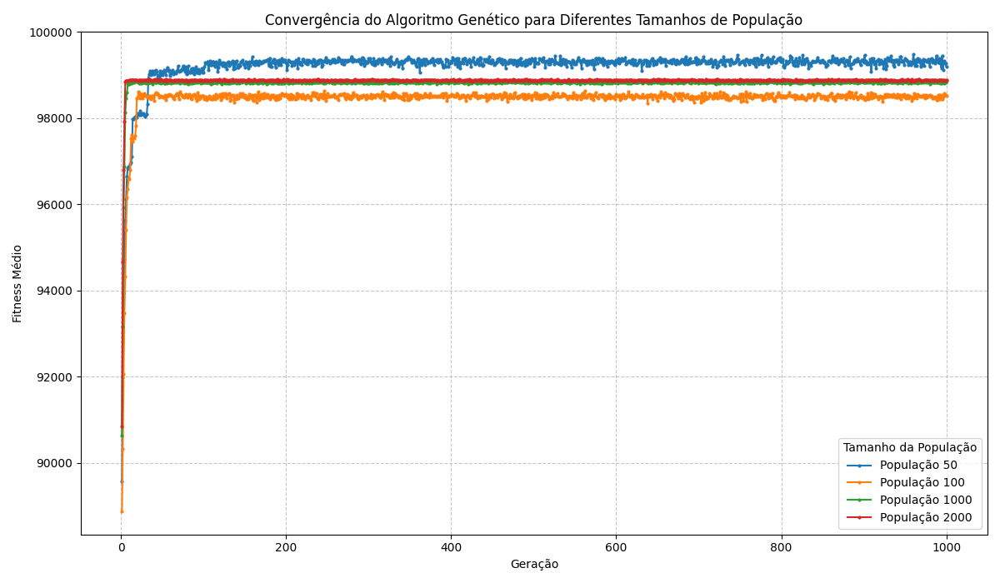
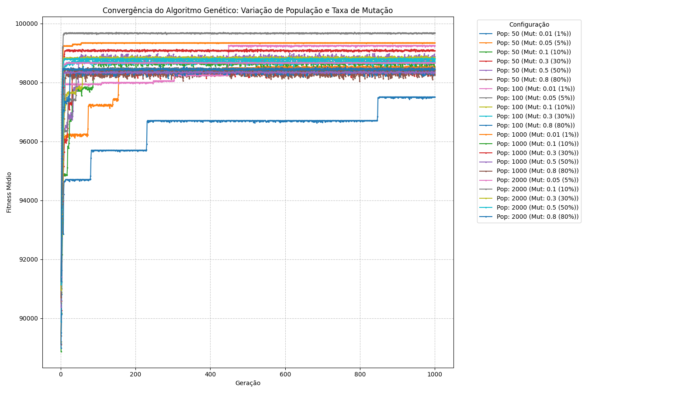

# 🏫 Otimização de Horários Universitários com Algoritmos Genéticos

Este projeto implementa um Algoritmo Genético para otimizar a alocação de disciplinas, professores, salas e horários em um ambiente universitário. O objetivo é criar um sistema de agendamento eficiente, minimizando conflitos e atendendo a diversas restrições.

## 💡 Visão Geral do Problema

O agendamento de horários universitários é um problema de otimização complexo, envolvendo múltiplas variáveis e restrições. As restrições podem ser classificadas como:

* **Rígidas:** Devem ser obrigatoriamente satisfeitas para que um horário seja considerado válido. Exemplos incluem:
    * Um professor não pode lecionar duas disciplinas no mesmo horário.
    * Uma sala não pode ser usada por duas disciplinas no mesmo horário.
    * A capacidade da sala deve ser maior ou igual ao número de alunos da disciplina.
    * Um aluno não pode ter duas disciplinas no mesmo horário.
* **Flexíveis:** Podem ser violadas, mas a violação resulta em uma penalidade na qualidade do horário. Exemplos incluem:
    * Preferências de turno dos professores.
    * Atribuição de professores preferidos a certas disciplinas.

## 🧬 Abordagem com Algoritmos Genéticos

Utilizamos um Algoritmo Genético (AG) para encontrar soluções ótimas ou quase ótimas para o problema de agendamento. O AG simula o processo de seleção natural para evoluir uma população de possíveis horários ao longo de gerações.

### Conceitos Chave

* **Cromossomo:** Representa uma solução completa para o problema de agendamento, ou seja, um conjunto de atribuições de aulas (disciplina, horário, sala, professor).
* **Gene:** Cada gene em um cromossomo representa uma única atribuição de aula.
* **População:** Um conjunto de cromossomos que evolui a cada geração.
* **Fitness (Aptidão):** Uma métrica que avalia a qualidade de um cromossomo. Quanto maior o fitness, melhor o horário. O cálculo do fitness penaliza as violações das restrições rígidas e flexíveis.
* **Seleção:** Processo de escolha dos cromossomos mais aptos da população para a reprodução. A seleção por roleta é utilizada, onde cromossomos com maior fitness têm maior probabilidade de serem selecionados.
* **Cruzamento (Crossover):** Operação que combina material genético de dois cromossomos "pais" para gerar novos cromossomos "filhos". Uma adaptação do PMX (Partially Mapped Crossover) é aplicada para garantir a integridade dos genes (disciplinas).
* **Mutação:** Pequenas alterações aleatórias nos genes de um cromossomo, introduzindo variabilidade na população e ajudando a evitar ótimos locais.
* **Elitismo:** Os cromossomos mais aptos de uma geração são diretamente passados para a próxima geração, garantindo que as melhores soluções não sejam perdidas.

## 📊 Como o Fitness é Calculado

O fitness é uma pontuação que reflete o quão boa é uma solução (cromossomo). Começa com uma pontuação base alta e penalidades são subtraídas para cada violação de restrição:

**Restrições Rígidas (Penalidade Alta - 1000 a 2000 pontos):**
* Conflito de Sala: Mais de uma aula na mesma sala no mesmo horário.
* Conflito de Professor: Mais de um professor lecionando no mesmo horário.
* Disponibilidade do Professor: Professor não disponível no horário atribuído.
* Capacidade da Sala: Número de alunos excede a capacidade da sala.
* Atribuição Inválida: IDs de disciplina, horário, sala ou professor não encontrados nos dados mestres.

**Restrições Flexíveis (Penalidade Média/Baixa - 50 a 500 pontos):**
* Preferência de Professor: Disciplina atribuída a um professor não preferido.
* Preferência de Turno do Professor: Aula agendada em turno diferente do preferido pelo professor.
* Conflito de Horário para Aluno: Um aluno matriculado em duas disciplinas que se sobrepõem no horário.

## ⚙️ Detalhes da Implementação

### Seleção por Roleta 🎡

A seleção por roleta é um método proporcional à aptidão onde cromossomos com maior fitness têm uma chance maior de serem escolhidos para a reprodução.

1.  **Cálculo do Percentual:** Primeiro, a população é ordenada de forma decrescente pelo valor de fitness (os melhores primeiro). Cada cromossomo recebe um "percentual" que representa sua fatia na roleta. Os cromossomos mais aptos recebem percentuais maiores. No nosso caso, o percentual diminui gradualmente para os cromossomos com fitness menor.
2.  **Giro da Roleta:** Um número aleatório é gerado entre 1 e a soma total dos percentuais de todos os cromossomos aptos (aqueles elegíveis para serem pais, definidos por `numeroCromossomosAptos`).
3.  **Seleção do Pai/Mãe:** O cromossomo cujo percentual acumulado inclui o número aleatório gerado é selecionado. Por exemplo, se o número aleatório cair na faixa de percentual do cromossomo X, ele é escolhido. Este processo é repetido para selecionar o segundo pai, garantindo que (sempre que possível) não seja o mesmo indivíduo.

### Cruzamento 🔗

1.  **Pontos de Corte:** Dois pontos de corte aleatórios são selecionados na sequência de aulas dos pais. Isso divide cada cromossomo em três segmentos: pré-corte, entre cortes e pós-corte.
2.  **Segmento Central:** O segmento central (entre os pontos de corte) de cada pai é copiado diretamente para o filho correspondente. Por exemplo, o segmento central do Pai 1 vai para o Filho 1, e o do Pai 2 vai para o Filho 2.
3.  **Mapeamento e Preenchimento:** Para os segmentos fora dos pontos de corte, a lógica é aplicada:
    * É criado um mapeamento entre os genes (aulas) presentes no segmento central do Pai 1 e os genes correspondentes no segmento central do Pai 2.
    * Para preencher as posições restantes no Filho 1, percorre-se a sequência do Pai 2. Se uma aula do Pai 2 já estiver presente no segmento central do Filho 1, a aula correspondente no mapeamento é usada. Se a aula mapeada também já estiver no Filho 1, o processo de mapeamento continua até encontrar uma aula que não esteja presente ou até que uma nova aula aleatória válida precise ser gerada.
    * O mesmo processo é aplicado para preencher o Filho 2 usando a sequência do Pai 1.
4.  **Reparo do Cromossomo:** Após o cruzamento, é crucial realizar um passo de reparo. Isso garante que:
    * Não haja disciplinas duplicadas no mesmo cromossomo.
    * Todas as disciplinas que deveriam ser agendadas (`numeroGenes`) estejam presentes no cromossomo.
    * Quaisquer "slots" vazios ou nulos resultantes do processo de cruzamento sejam preenchidos com atribuições de aulas válidas para disciplinas faltantes. Este reparo é vital para manter a validade das soluções.

### Mutação 🧪

A mutação introduz diversidade na população, evitando que o algoritmo fique preso em ótimos locais.
1.  **Seleção Aleatória:** Uma aula aleatória dentro do cromossomo é escolhida para mutação.
2.  **Alteração de Atributo:** Um atributo específico dessa aula (horário, sala ou professor) é alterado aleatoriamente para uma nova opção válida dentro das disponíveis.
3.  **Recálculo de Fitness:** Após a mutação, o fitness do cromossomo é marcado como não calculado, forçando sua reavaliação na próxima etapa de cálculo de fitness.

## 📁 Estrutura do Projeto (Classes Principais)

* `AlgoritmoGenetico.java`: A classe principal que implementa o algoritmo genético, incluindo a inicialização da população, cálculo de fitness, seleção, cruzamento e mutação.
* `Cromossomo.java`: Representa um cromossomo, contendo a sequência de aulas e seu valor de fitness.
* `Aula.java`: Representa uma única atribuição de aula (disciplina, horário, sala, professor).
* `Disciplina.java`: Define as propriedades de uma disciplina (ID, nome, número estimado de alunos, professores preferidos).
* `Professor.java`: Define as propriedades de um professor (ID, nome, horários disponíveis, preferência de turno).
* `Sala.java`: Define as propriedades de uma sala (ID, nome, capacidade, horários disponíveis).
* `Horario.java`: Define as propriedades de um horário (ID, dia da semana, hora de início, hora de fim, turno) e inclui lógica para verificar sobreposição.
* `Aluno.java`: (Presente no código, mas não totalmente utilizado na lógica de agendamento atual - pode ser expandido para futuras restrições de alunos.)
* `CompararCromosso.java`: Um `Comparator` para ordenar os cromossomos com base em seu fitness.

## 🚀 Executando o Projeto

1.  **Compilação:** 
    javac AG/*.java Dominio/*.java
2.  **Execução:** Execute a classe principal `AlgoritmoGenetico`.
    java AG.AlgoritmoGenetico

### Saída do Console 🖥️

Durante a execução, o programa irá imprimir no console o progresso de cada geração, incluindo:
* População inicial e atual.
* Número de gerações.
* Grau médio de fitness da população.
* Quantidade de "mortos" (cromossomos removidos pela seleção/mortalidade).
* Quantidade de "mutantes" (cromossomos que sofreram mutação).

### Arquivos de Saída 📝

Além da saída no console, serão gerados arquivos:
* `[numeroCromossomos]_[numeroEvolucoes]_saida_.txt`: Contém o grau médio de fitness por geração, útil para análises de convergência.
* `[numeroCromossomos]_[numeroEvolucoes]_saida_.res`: Salva os cromossomos mais aptos de cada geração, mostrando sua posição, fitness, percentual de seleção e a sequência de aulas.

---

## 📈 Gráficos de Convergência do Fitness Médio

### Comparação por Tamanho de População

Este gráfico ilustra a evolução do fitness médio da população ao longo das gerações para diferentes tamanhos de população, mantendo outros parâmetros constantes.

*Inferências sobre os Dados de População:*
* **Qualidade da Solução:** Populações maiores (1000 e 2000) geralmente atingem um fitness médio final mais alto, indicando soluções de melhor qualidade devido à maior diversidade genética e exploração do espaço de busca.
* **Velocidade de Convergência:** Populações menores (50 e 100) tendem a convergir mais rapidamente (em menos gerações), mas podem se estabilizar em um fitness inferior, pois são mais propensas a ótimos locais.
* **Trade-off:** O gráfico demonstra o trade-off entre a qualidade da solução (favorecida por populações maiores) e o tempo computacional (favorecido por populações menores).

---

### Comparação por Taxa de Mutação

Para entender o impacto da **taxa de mutação** (`taxaMutabilidade`), realizamos experimentos variando-a (0.01%, 0.05%, 0.1%, 0.3%, 0.5% e 0.8%) enquanto mantivemos o tamanho da população (ex: 50 cromossomos) e o número de gerações (1000) constantes.

O gráfico a seguir ilustra a convergência do fitness médio para cada uma dessas configurações de mutação:

*Inferências sobre os Dados de Mutação:*
* **Exploração vs. Explotação:** Taxas de mutação mais altas (ex: 0.5, 0.8) tendem a aumentar a **exploração** do espaço de busca, introduzindo mais diversidade e ajudando a evitar ótimos locais. No gráfico, isso pode resultar em curvas mais irregulares ou na capacidade de alcançar um fitness mais alto a longo prazo. No entanto, se for muito alta, pode impedir a convergência ou tornar a busca muito aleatória.
* **Refinamento da Solução:** Taxas de mutação mais baixas (ex: 0.01, 0.05) focam na **explotação** (refinamento de soluções existentes), levando a uma convergência mais suave, mas com o risco de ficar presa em ótimos locais subótimos. O gráfico pode mostrar essas curvas estabilizando-se mais cedo em um fitness potencialmente mais baixo.
* **Ponto Ideal:** Geralmente, existe um "ponto ideal" (sweet spot) para a taxa de mutação (muitas vezes em valores moderados como 0.1 ou 0.3) onde há um equilíbrio entre a capacidade de explorar novas soluções e refinar as existentes, levando a um bom fitness final.

---

## 💡 Futuras Melhorias

* **Entrada de Dados Reais:** Implementar a leitura de dados de disciplinas, professores, salas e alunos de arquivos (CSV, JSON, XML) ou um banco de dados, em vez de dados de exemplo hardcoded.
* **Tipos de Cruzamento e Mutação:** Explorar outros operadores genéticos (e.g., Uniform Crossover, Swap Mutation) e comparar seu desempenho.
* **Visualização de Resultados:** Desenvolver uma interface gráfica (GUI) para visualizar os horários gerados e o progresso do algoritmo.
* **Métricas de Desempenho:** Adicionar métricas mais detalhadas para avaliar a qualidade das soluções e a eficiência do algoritmo (tempo de execução, número de violações, etc.).
* **Otimização de Parâmetros:** Realizar estudos para encontrar os melhores valores para os parâmetros do AG (tamanho da população, taxas de mutação/cruzamento).
* **Restrições Adicionais:** Incorporar outras restrições comuns em agendamentos universitários, como:
    * Preferências de sala (e.g., laboratórios para disciplinas específicas).
    * Pré-requisitos de disciplinas (para alunos).
    * Cargas horárias máximas/mínimas para professores.
    * Balanceamento de carga de trabalho entre professores.
